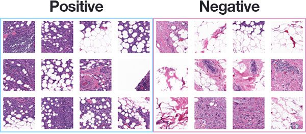

# Breast Cancer Classification API



This project demonstrates how to deploy a pre-trained machine learning model as a web service using FastAPI. The machine
learning model used in this project is a `RandomForestClassifier`, trained on a Breast Cancer classification dataset.
The trained model is served via an API endpoint created with FastAPI, allowing users to make predictions by sending HTTP
requests.

## Table of Contents

- [Installation](#installation)
- [Usage](#usage)
- [Endpoints](#endpoints)
- [Contributing](#contributing)
- [License](#license)

## Installation

1. **Clone the repository:**

    ```bash
    git clone https://github.com/emiliodallatorre/unive-breastcancer-classification.git
    cd your-repo-name
    ```

2. **Create and activate a virtual environment:**

    ```bash
    python -m venv venv
    source venv/bin/activate   # On Windows use `env\Scripts\activate`
    ```

3. **Install the required dependencies:**

    ```bash
    pip install -r requirements.txt
    ```

## Usage

### Running the FastAPI Application

1. **Start the FastAPI server:**

    ```bash
    uvicorn server:app --host 0.0.0.0 # Or use ./start.sh
    ```

2. **Access the API:**
   Open your browser and navigate to `http://127.0.0.1:8000/docs` to view the automatically generated API documentation
   and interact with the API.

## Endpoints

### `/predict` [POST]

- **Description:** This endpoint accepts a JSON payload containing the features required by the model and returns the
  prediction.

- **Request Body:**

    ```json
    {
      "radius": 0,
      "perimeter": 0,
      "area": 0
    }
    ```

- **Response:**

    ```json
    {
      "diagnosis": "B",
      "probabilities": {
        "B": 1,
        "M": 0
      }
    }
    ```

## Contributing

Contributions are welcome! Please fork the repository and submit a pull request for any bug fixes, improvements, or new
features.

1. Fork the Project
2. Create your Feature Branch (`git checkout -b feature/AmazingFeature`)
3. Commit your Changes (`git commit -m 'Add some AmazingFeature'`)
4. Push to the Branch (`git push origin feature/AmazingFeature`)
5. Open a Pull Request

## License

Distributed under the MIT License. See `LICENSE` for more information.
